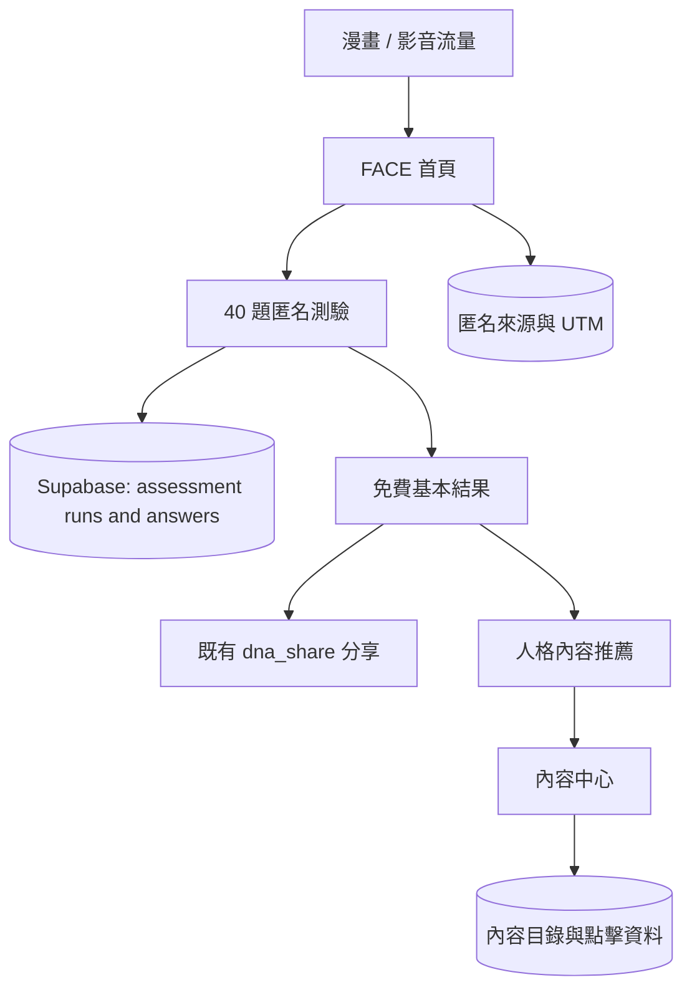

# FACE Content Hub Rebuild

## Goal Capsule

將目前的 FACE 單頁「投資靈魂日記」重構為「交易人格探索中心」。
新版以匿名 40 題 FACE 測驗為入口，完成後提供基本結果與一則內容推薦，並以可持續維護的影片、Podcast、文章內容中心承接後續探索。
本計畫保留既有的 16 型人格內容、視覺語言、匿名測驗保存、安全資料層，以及 `?dna_share=` 分享網址格式。
本計畫不建置 HubSpot、LINE Login、PostHog、付費會員、AI 諮詢或桌遊產品功能。

---

## Product Contract

### Summary

本計畫會把 40 題、四種題型的 FACE 題庫轉成可版本化的前端資料模型，讓圖像題先使用可替換的版位與替代文字。
網站會移除 AI 交易解憂 Bar，新增可由靜態資料維護的內容中心，並補齊這一輪需要的匿名顧客資料、來源與內容互動資料結構。

### Problem Frame

目前網站只有 20 題二選一題庫，使用者完成後主要停在儀表板與 AI Bar，無法形成「內容導流、人格探索、內容推薦、提出需求」的產品路徑。
Supabase 已安全保存匿名測驗與答案，但尚未有顧客識別、來源歸因、內容互動或需求表單的資料模型，因此不能回答使用者從哪裡來、看了什麼內容或需要什麼協助。
新的 40 題題庫已經定稿為情境題 16 題、圖像題 8 題、直覺題 8 題、是非題 8 題；每個 FACE 維度各有 10 題。

### Requirements

#### FACE assessment

- R1. 網站提供 40 題匿名 FACE 測驗，不在測驗開始前要求登入。
- R2. 題庫包含情境、圖像、直覺與是非四種題型；每個 FACE 維度恰有 10 題。
- R3. 每一個選項必須明確指定對應特質，支援是非題的反向計分，不能再依賴「A 永遠是第一端」的假設。
- R4. 新結果以 `face-baseline-40q-v1` 保存，舊的 `face-baseline-20q-v1` 資料可繼續讀取且不被覆寫。
- R5. 每維使用 10 題、每題 10 分；若同一維度為 5:5，結果應顯示「平衡傾向」，同時以既有主碼規則維持 16 型人格內容的相容性。 session-settled: 顯示平衡傾向，chosen over 假裝為單一絕對傾向。
- R6. 圖像題需先存在於題庫與作答流程，使用可替換的圖片資產欄位與替代文字；圖片交付前顯示一致的暫用版位。 session-settled: 先保存圖像題結構，chosen over 等待圖片才開始建置。

#### Results, content, and navigation

- R7. 首頁與導覽將 FACE 定位為交易人格探索中心，保留現有視覺語言與 16 型內容。
- R8. AI 交易解憂 Bar 從導覽、畫面、前端呼叫與 Gemini Bar endpoint 移除。 session-settled: 移除 AI Bar，chosen over 保留為隱藏功能。
- R9. 完成結果免費顯示 FACE 主碼、角色、四維傾向、核心優勢、一個主要盲點與一則推薦內容。
- R10. 建立內容中心，以人工維護的 YouTube、Podcast、文章連結與標籤提供篩選與人格推薦；不導入 CMS。
- R11. 所有分享仍使用既有 `?dna_share=` query key 與八個分數的編碼順序；分享頁不可讀取原始答案或其他匿名資料。
- R12. 如果沒有符合人格標籤的內容，結果頁須顯示人工指定的通用入門內容。

#### Data and customer learning

- R13. Supabase 繼續以 Anonymous Auth 與 RLS 保存測驗；完整測驗需產生一筆 `assessment_runs` 與恰好 40 筆 `assessment_answers`。
- R14. 將可在未登入階段取得的第一觸來源、UTM 與登入頁保存為匿名來源資料，且不得要求個人身份資訊。
- R15. 內容目錄、站內內容點擊事件與未來需求表單需有 RLS 保護的資料結構；完整 40 題答案不得寫入 CRM 或分析服務。
- R16. 介面與資料蒐集需清楚區分交易行為探索與個別投資建議，不把結果呈現為心理診斷或投資適合度判定。

### Key Flows

- F1. 內容觀眾完成測驗
  - **Trigger:** 來自漫畫、影片或其他連結的訪客按下首頁主要 CTA。
  - **Steps:** 首頁說明測驗價值 → 匿名建立測驗 session → 完成 40 題 → 原子寫入答案與結果 → 顯示基本人格結果與推薦內容。
  - **Outcome:** 測驗資料可供產品分析，使用者不必先登入。
- F2. 結果者探索內容
  - **Trigger:** 使用者在結果頁點選推薦內容或「看更多適合我的內容」。
  - **Steps:** 以 FACE 主碼、四維傾向與痛點標籤篩選靜態內容目錄 → 顯示內容卡 → 記錄站內點擊。
  - **Outcome:** 使用者進入真實內容，而不是 AI 對話。
- F3. 分享結果
  - **Trigger:** 完成測驗者選擇分享。
  - **Steps:** 產生現有格式的 `?dna_share=` 網址 → 接收者只讀解析分數 → 顯示分享儀表板與自行測驗 CTA。
  - **Outcome:** 不暴露答案、匿名使用者 ID 或其他使用者資料。

### Scope Boundaries

#### Deferred to follow-up work

- 真正會員帳戶、Email magic link、LINE Login 與跨裝置合併匿名結果。
- HubSpot 同步、PostHog、LINE 官方帳號與 CRM 自動化。
- 需求表單送出後的人工流程與 CRM 需求分數。
- SEO 的 SSR／Next.js 遷移、付費牆、點數、社群與桌遊產品化。
- 每日 AI 題目與每日 AI 報告維持現狀，這一輪不隨 AI Bar 一併移除；是否保留將在獨立決策中處理。

---

## Planning Contract

### Key Technical Decisions

- KTD1. **題庫使用明確的選項特質對應。** 每題記錄 `dimension`、`type` 與每個可選答案的 `trait`，讓 A/B、是/否及反向題都走同一套計分器。這避免目前 `pair[0]`／`pair[1]` 的固定順序導致反向題算錯。
- KTD2. **圖像題使用資產參照而不是把圖片嵌進題目文案。** 每題先有穩定 `assetKey`、`alt`、暫用版位和圖片比例；日後只要將相同 `assetKey` 指向正式圖片即可替換。
- KTD3. **40 題採新版本並保留舊資料。** 現有 RPC 以 `question_count` 驗證答案數，能相容 40 題；新增資料只寫 `face-baseline-40q-v1`，不回寫 20 題紀錄。
- KTD4. **內容中心先採程式內靜態目錄。** 內容卡用集中的 TypeScript catalog 維護外部網址與標籤，同步可選地寫入 Supabase `content_items`；不先建立 CMS 管理介面。
- KTD5. **來源與互動資料分離於原始答案。** 原始 40 題答案只保留在 `assessment_answers`；來源、內容點擊與未來需求資料分表並採最小蒐集原則。
- KTD6. **使用瀏覽器 History API 的輕量路徑同步。** 維持 Vite，而不是遷移 Next.js；將首頁、測驗、結果與內容中心映射成可分享的前端路徑，同時保留既有分享 query 的解析。

### High-Level Technical Design

### Assumptions and Open Questions

- A1. 圖像題正式素材尚未提供；暫用版位與替代文字可先上線，但不應假裝為正式測驗圖。
- A2. 內容中心初版至少需要一則通用入門內容，及每個人格或維度可逐步補上的推薦內容；尚未提供的外部連結會以不可點擊的編輯提示處理，不產生失效連結。
- A3. 平衡傾向仍用既有 `>=` 主碼規則選出相容的 16 型角色，但結果頁會可見地標示該維度平衡，避免誤導為明確偏向。
- A4. 真正可識別的 CRM 顧客資料須等待會員／LINE Login；本輪只累積匿名行為資料，不能把匿名 UUID 說成顧客身份。

### Delivery Sequence

U1 → U2 → U3 可先建立可驗證的測驗與資料版本；U4、U5 將結果接到內容與匿名學習資料；U6 最後整理移除範圍、相容性與驗證。

---

## Implementation Units

### U1. Establish the FACE 40-question domain model

- **Goal:** 將使用者提供的 40 題題庫及其交錯順序轉成具型別、可維護、可版本化的資料。
- **Requirements:** R1, R2, R3, R4, R5, R6.
- **Files:** `types.ts`, `constants.tsx`, new `data/faceQuestions.ts`, new `data/faceQuestionOrder.ts`.
- **Approach:** 新增題型、維度、選項與資產參照的型別；輸入 40 題的文字、特質對應和順序表；將圖像題建立為有 `assetKey` 與 `alt` 的 placeholder；使用 `face-baseline-40q-v1` 常數，保留舊 20 題資料以支援歷史閱讀。
- **Patterns:** 擴展現有 `Question` 與 `FaceScores` 型別；題目 ID 採穩定且可追溯的形式，例如題型加流水號；不以展示文字推導資料意義。
- **Test Scenarios:** 確認總數 40、四維各 10、四題型為 16/8/8/8、順序表無重複且涵蓋全部題目、8 題圖像題都有 placeholder 資產鍵。
- **Verification:** 新增資料完整性單元測試；人工核對題庫與使用者提供文件。

### U2. Generalize assessment rendering, scoring, and persistence

- **Goal:** 讓測驗頁能正確呈現四種題型、反向是非計分與平衡傾向，並安全保存 40 題結果。
- **Requirements:** R1, R3, R4, R5, R6, R13, R16.
- **Files:** `components/Assessment.tsx`, `services/assessmentPersistence.ts`, `constants.tsx`, `App.tsx`, `types.ts`, new scoring utility and tests.
- **Approach:** 將計分從選項位置改為選項特質；為情境／直覺題使用文字卡，圖像題使用圖片或 placeholder 卡，是非題使用「是／否」控制；保留上一題、重試保存與匿名 session；結果模型新增每維平衡旗標；基準測驗改用 40 題、每題 10 分與新版本。
- **Patterns:** 沿用 `AssessmentPersistenceError`、client-generated run UUID、Supabase RPC 的冪等重試與 `question_count` 驗證；不可將 raw answers 寫進 localStorage 以外的未授權服務。
- **Test Scenarios:** 正向與反向題的特質加分、每維 5:5、40 題儲存成功、斷網後重試、重複按完成、20 題舊資料與 40 題新資料並存。
- **Verification:** 執行型別檢查與建置；在 Supabase 確認一筆新 run 有 `question_count = 40` 與恰好 40 個答案。

### U3. Extend the privacy-preserving customer-learning schema

- **Goal:** 讓 Supabase 能保存匿名來源、內容目錄與內容點擊，同時為日後需求表單保留最小且受保護的結構。
- **Requirements:** R13, R14, R15, R16.
- **Files:** new `supabase/migrations/<timestamp>_extend_content_and_customer_learning.sql`, `lib/database.types.ts`, `services/assessmentPersistence.ts`, new `services/attributionPersistence.ts`, new `services/contentPersistence.ts`, `supabase/README.md`.
- **Approach:** 建立 `source_attribution`、`content_items`、`content_events` 與 `consultation_requests`；將匿名 visitor 與 authenticated user 都納入資料關聯；對每張表啟用 RLS、限定使用者只讀寫自己的資料，並只開放前端必要欄位；不建立 `profiles` 直到有真實登入來源。
- **Patterns:** 延續既有 migration、RLS policy、RPC／約束與 browser-safe anon key；所有外部 CRM token 保持不存在於前端。
- **Test Scenarios:** 新訪客 UTM 第一次來源只寫一次、不同匿名 session 不能讀別人的事件或諮詢、未登入者不能偽造另一 user_id、原始答案不會出現在內容或來源表。
- **Verification:** Supabase SQL Editor 檢查表、索引、RLS 及 policy；以兩個不同瀏覽器 session 手動測試存取邊界。

### U4. Rebuild the result journey and static content center

- **Goal:** 把完成測驗後的下一步改為真實內容推薦，而不是 AI Bar。
- **Requirements:** R7, R9, R10, R12, R16.
- **Files:** `App.tsx`, `components/Dashboard.tsx`, new `components/ContentHub.tsx`, new `components/ContentCard.tsx`, new `data/contentCatalog.ts`, `types.ts`, `styles/globals.css`.
- **Approach:** 在現有結果頁加入基本免費摘要與推薦卡；建立依 FACE 代碼、維度和痛點標籤篩選的內容中心；外部影片、Podcast 和文章保持明確標示；無匹配時顯示通用內容；點擊事件以最少資料寫入 `content_events`。
- **Patterns:** 延用 Zen 視覺 token、現有 Dashboard 圖表與角色資料；內容資料集中管理，不散落在 JSX；內容尚未提供外部網址時維持不可點擊的編輯態，不猜測網址。
- **Test Scenarios:** 特定 FACE 結果取得匹配推薦、無匹配走 fallback、標籤組合篩選、外部網址安全開啟、只記錄站內 click 而不虛報觀看完成。
- **Verification:** 手機與桌面手測結果→內容中心流程；檢查 Supabase event 不含題目答案或完整諮詢文字。

### U5. Replace the state-only navigation with shareable Vite paths

- **Goal:** 讓首頁、測驗、結果與內容中心具有可直接開啟的路徑，同時不破壞現有結果分享。
- **Requirements:** R7, R10, R11.
- **Files:** `App.tsx`, `components/ZenLayout.tsx`, `vercel.json`, new route utility, `index.html`.
- **Approach:** 以輕量 History API 路由同步目前 view state，對應 `/`、`/test`、`/result`、`/watch`、`/about`；維持 Vercel SPA rewrite；保留 `?dna_share=` 優先解析和現有 shared dashboard 邏輯；更新頁面 title、description 與分享文案，去除 AI Bar 導向。
- **Patterns:** 不在此單元引入 Next.js 或改變分享 query key；未知路徑應回到首頁或顯示安全的 not-found 狀態。
- **Test Scenarios:** 重新整理各路徑、直接開啟分享網址、回上一頁、分享者資料不洩漏、Vercel rewrite 不造成 404。
- **Verification:** 本地 Vite 與 Vercel preview 分別測試；手動比較改造前後 `?dna_share=` 的解析結果。

### U6. Remove the AI Bar and complete quality safeguards

- **Goal:** 移除錯置的 AI Bar 產品路徑，清理相依程式與文案，並建立重構後的驗收基線。
- **Requirements:** R7, R8, R11, R16.
- **Files:** `components/WorryFreeBar.tsx`, `components/ZenLayout.tsx`, `App.tsx`, `services/geminiService.ts`, `api/gemini/bar.ts`, `api/README.md`, `index.html`, `components/AboutFace.tsx`, `README.md`.
- **Approach:** 移除 Bar 元件、視圖、導覽、前端 service 和 API endpoint；更新所有「交易解憂 Bar」文字為真實內容中心的定位；保留每日 AI 題目／報告程式與 server-only Gemini 安全邊界，避免擴大本次刪除範圍；新增測試與手動檢查清單。
- **Patterns:** 以安全刪除為原則，先移除呼叫端、再刪 endpoint；不刪 `GEMINI_API_KEY` 或其他仍被每日功能使用的 server-only 設定。
- **Test Scenarios:** 導覽與 bundle 無 Bar 入口、舊 Bar 路徑安全回退、每日功能未被意外移除、沒有 `VITE_GEMINI_API_KEY`、分享與匿名測驗仍正常。
- **Verification:** `rg` 確認 Bar 呼叫與 endpoint 已無存留；型別檢查、production build、手動完整測驗與分享回歸測試。

---

## Verification Contract

| Gate | Applies to | Command or procedure | Done signal |
| --- | --- | --- | --- |
| Type safety | U1-U6 | `npm run typecheck` | TypeScript 無錯誤。 |
| Production bundle | U1-U6 | `npm run build` | Vite production build 成功。 |
| Question integrity | U1-U2 | Unit test or data assertion | 40 題、每維 10 題、所有選項可映射特質。 |
| Supabase persistence | U2-U3 | 完成一次匿名 40 題測驗並查詢資料表 | 1 筆 completed run、40 筆 answers、正確版本與分數。 |
| RLS boundary | U3 | 使用第二個瀏覽器 profile 查詢資料 | 不能讀取第一個 profile 的 rows。 |
| Result/content journey | U4-U5 | 手機與桌面手測 | 結果顯示推薦、可進內容中心、fallback 可用。 |
| Share compatibility | U5-U6 | 開啟既有與新產生的 `?dna_share=` URL | 僅顯示只讀結果，沒有答案或身份資料。 |
| AI Bar removal | U6 | 路由、導覽、搜尋與 API smoke check | 無 AI Bar 入口或 endpoint，保留的每日 AI 功能仍可用。 |

---

## Definition of Done

- 40 題題庫、反向題、平衡傾向和圖像 placeholder 已由自動檢查與人工題庫核對覆蓋。
- 新完成的測驗以 `face-baseline-40q-v1` 和 40 個答案安全保存，既有 20 題資料沒有被覆寫。
- 結果頁、內容中心、分享網址與匿名資料邊界均通過驗證。
- AI 交易解憂 Bar 已完全移除，真實內容中心取代其導覽位置。
- 新增資料表均啟用 RLS，且沒有 service-role、HubSpot token 或 Gemini key 出現在前端環境變數或 bundle。
- README 與 Supabase 操作說明反映目前資料表、環境變數與手動驗收方式。
- 任何未採用的實驗性路由、題庫、圖片或資料庫程式不殘留在最終差異中。
