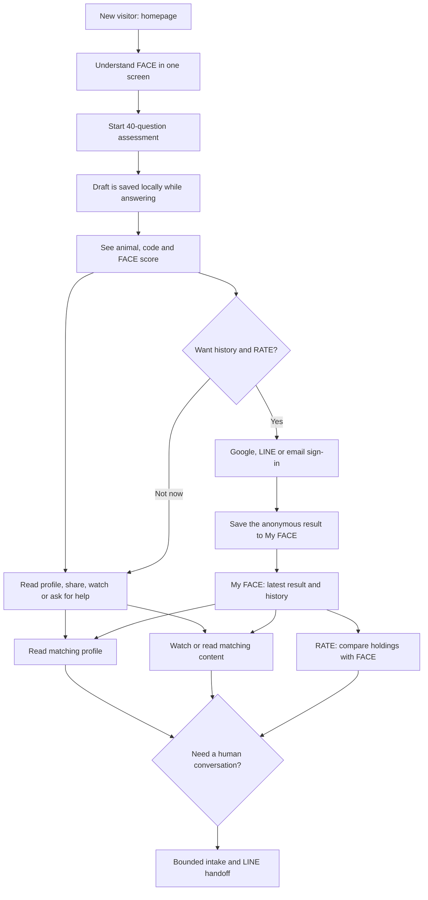

# FACE Website Conversion Funnel Optimisation

## Goal Capsule

Create one calm, understandable journey for FACE visitors: understand the value, complete the 40-question assessment without being forced to register, see and share their result freely, optionally save it through an account for long-term history and RATE, continue into relevant content, and request a bounded first conversation when needed.

The product authority is the existing FACE identity: an investment-behaviour exploration tool, not a psychological diagnosis, stock recommendation, or return promise.

This plan keeps the current Vite + Supabase architecture and the four FACE scoring dimensions unchanged: 獲利動機, 決策邏輯, 交易週期, 資金管理.

The work stops before payment, calendar booking, HubSpot, LINE OA messaging automation, or personalised investment recommendations.

## Product Contract

### Problem Frame

FACE already has a strong collection of pages: the assessment, result, 16-type gallery, content hub, RATE prototype, founder profile, and Google/LINE/email sign-in.

The problem is not a lack of pages. The next action changes from page to page, so a visitor can finish the test without clearly seeing why they should save the result, what to do after reading it, or how RATE and a future consultation relate to their own result.

The revised funnel should make every page answer one question: “What is the most useful next step for me now?”

### Journey Map

### Requirements

**First visit and assessment**

- R1. The homepage must make the main promise, assessment effort, no-login-first policy, and outcome clear before the primary CTA.
- R2. A visitor can start the assessment without registering and can resume an interrupted attempt in the same browser.
- R3. The existing 40-question order, image questions, FACE scoring logic, result URL behaviour, and visual language remain intact.
- R4. A completed assessment has a local recovery copy even if the network or Supabase write fails.

**Result and account value**

- R5. The completed result, profile link, sharing, and introductory content must remain available without sign-in; sign-in is an optional value upgrade rather than an access barrier.
- R6. The result page must explain the two concrete account benefits in plain language: keep a personal result history and unlock RATE self-selected-holding alignment review.
- R7. Signing in after an anonymous assessment must attach that assessment to the signed-in account without changing the result or producing a duplicate user-visible record.
- R8. A signed-in user has a single “我的 FACE” home where they can see the latest result, historical results, recommended content, and the next available product action.
- R9. The product must not silently assume that separately created Google, LINE, and magic-link identities with the same email are automatically one account.

**Content, RATE, and help**

- R10. Content recommendations must use the latest FACE result where available and keep users on FACE pages; external video is embedded rather than replacing the site journey where possible.
- R11. RATE remains a contextual member-only next step, surfaced after a saved FACE result and on the About page, not restored as a crowded top-navigation item.
- R12. The help entry point is framed as a “初談申請／交易行為與決策整理”, gathers only the information needed for first contact, records explicit consent, and hands the user to LINE with context. It does not give investment advice or collect brokerage credentials.
- R13. Consultation copy and forms must not ask for, advertise, or promise individual-security buy/sell advice, entry/exit timing, target prices, position sizing, or return forecasts.

**Trust, measurement, and discoverability**

- R14. Public pages state that FACE is a trading-style exploration tool; result, test, member, and RATE pages remain non-indexable.
- R15. Measurement records funnel stage only, never raw question answers, private consultation text, LINE conversation content, or holdings data.
- R16. All new personal data tables use Supabase Row Level Security and only permit a signed-in user to access their own records.

### Key Flows

- F1. New visitor starts the assessment
  - **Trigger:** Visitor selects the primary homepage CTA.
  - **Steps:** Explain test value briefly, open `/test`, create or restore a browser draft, and continue from the last answered question.
  - **Outcome:** The visitor can finish without sign-in friction and without losing progress.
  - **Covers:** R1-R4.

- F2. Guest completes, explores, and optionally saves a result
  - **Trigger:** A guest reaches the result page.
  - **Steps:** Show identity first, then score; keep profile, share, content, and help available; explain “保存我的結果” as the way to track future changes and use RATE; after Google, LINE, or email sign-in, claim the anonymous run and open `/me`.
  - **Outcome:** Registration has an obvious benefit without withholding the result.
  - **Covers:** R5-R9.

- F3. Member chooses a next activity
  - **Trigger:** A signed-in user opens `/me` or returns after saving a result.
  - **Steps:** Show latest profile, one recommended content item, one contextual RATE entry, and a low-pressure help CTA.
  - **Outcome:** The result becomes a continuing product relationship rather than a dead end.
  - **Covers:** R8, R10-R12.

- F4. User requests help
  - **Trigger:** A user selects the consultation CTA from the result, profile, content, RATE, or coach page.
  - **Steps:** Ask about behaviour, decision process, or general learning context; state the non-advice boundary before submission; collect contact/marketing consent separately; save the request; generate a contextual LINE handoff.
  - **Outcome:** The founder receives a qualified, consented request instead of an uncontextualised LINE message or a request for individual-security advice.
  - **Covers:** R12-R13, R16.

### Scope Boundaries

**Included**

- Anonymous draft recovery, post-login result claiming, a member hub, contextual result navigation, content matching, consultation intake, privacy-safe event contract, and public-page SEO foundations.

**Deferred**

- Paid booking, payment gateway selection, calendar availability, HubSpot synchronisation, LINE OA automation, paid article entitlement, complete cross-provider account merging, and a holdings-analysis backend.

**Outside this product identity**

- Stock recommendations, trading signals, guaranteed returns, portfolio custody, and psychological diagnosis.

## Planning Contract

### Key Technical Decisions

- KTD1. **Keep Vite and the history-based router.** The current SPA can deliver the product flow without a Next.js migration; SEO work will improve public routes first and does not block P0 retention work.

- KTD2. **Use browser drafts for incomplete assessments and Supabase only for completed runs.** This limits sensitive partial-answer storage, supports interruption recovery, and retains the current completed-run data model.

- KTD3. **Claim an anonymous run through a narrow Supabase RPC after sign-in.** The browser must not update arbitrary assessment ownership directly. The RPC validates the run, the browser’s anonymous session, and the new authenticated user before ownership changes.

- KTD4. **Treat identity linking as explicit, not email-based magic.** A post-test guest result can be claimed within the same browser session. Separately created provider identities are not automatically merged only because their emails look the same; a later account-linking flow handles that safely.

- KTD5. **Use `/me` as the account-value hub, not the only result destination.** Guests retain access to their result, sharing, type profile, content, and help. `/me` adds durable history and member-only RATE.

- KTD6. **Keep RATE contextual.** RATE appears where a saved FACE result makes it meaningful: the result next-step panel, `/me`, and the About page. It remains absent from the top navigation.

- KTD7. **Use first-party, privacy-safe funnel events behind an adapter.** Define events now and connect PostHog only after its project and privacy policy are approved. The first implementation must work with an inert adapter and must not transmit raw answers.

- KTD8. **Separate “contact consent” from “marketing consent.”** A user can request help without agreeing to marketing messages; each consent is recorded independently and versioned.

- KTD9. **Describe the human service as decision-process coaching, not a securities recommendation service.** The public CTA will be “申請初談” rather than “LINE@ 諮詢個股”. The intake explicitly excludes individual-security buy/sell, timing, target-price, allocation, and performance-forecast requests. A lawyer or compliance professional must review the final paid-service scope before it is sold.

### Data and Route Design

The implementation introduces these product-facing routes while preserving all current routes.

| Route | Audience | Purpose | Indexing |
| --- | --- | --- | --- |
| `/` | Public | Explain FACE and start/resume the assessment | Index |
| `/test` | Public | Complete or resume the 40-question assessment | Noindex |
| `/result` or existing result state | Public/member | Show a completed result, sharing, content, save benefits, and next steps | Noindex |
| `/me` | Signed-in | Latest result, result history, recommendations, RATE entry | Noindex |
| `/types`, `/types/:code` | Public | Explore the 16 trading styles | Index |
| `/watch`, `/watch/:slug` | Public | Read or watch content | Index |
| `/about`, `/coach` | Public | Explain FACE and founder credibility | Index |
| `/mirror-trade` | Signed-in | RATE holding alignment workflow | Noindex |
| `/consult` | Signed-in preferred | Request a first conversation and LINE handoff | Noindex |

The migration work adds or extends these records:

- `profiles` for the product-facing member profile and consent versions.
- `assessment_runs` ownership/claim metadata sufficient to identify a run created as anonymous and later claimed after sign-in.
- `consultation_requests` for an explicit, minimal contact request.
- `funnel_events` only if first-party telemetry is approved in U7; it contains stage-level metadata, not answers or consultation text.

### Sequencing

U1 and U2 establish a stable assessment and result handoff.

U3 makes account creation worthwhile and must precede U4’s member navigation.

U4 and U5 make the content and RATE branches meaningful after a saved result.

U6 creates the human-help branch after the contextual entry points exist.

U7 and U8 can run after the core flow, because they observe and expose the funnel rather than define its correctness.

### Open Questions

- OQ1. **Deferred:** Confirm the public-facing promise for assessment duration after timing real users. Until then, use “40 題、可隨時續作” rather than a potentially inaccurate minute count.
- OQ2. **Deferred:** Define the exact first free consultation length, availability, and paid follow-up price before a payment or booking unit is planned.
- OQ3. **Deferred:** Decide which articles are public previews versus paid member content before introducing a payment provider or entitlement schema.
- OQ4. **Deferred:** Decide whether cross-device identity merging needs a self-service account-linking screen or manual support flow after real login patterns are observed.

## Implementation Units

### U1. Clarify the first-visit and test-entry promise

- **Goal:** Make the homepage and test start state answer what FACE is, what the visitor receives, and why login is not requested yet.
- **Files:** Update `components/Landing.tsx`, `components/LandingInfo.tsx`, `components/FaceAssessment.tsx`, `App.tsx`, and shared style files already used by those components. Add `lib/funnelCopy.ts` and `lib/__tests__/funnelCopy.test.ts`.
- **Patterns:** Reuse the current visual system; add a compact trust strip beside the primary CTA rather than another large section. Offer “繼續上次測驗” only when a local draft exists.
- **Test scenarios:** Verify the first CTA goes to `/test`; verify guests see no login gate before answering; verify the resume CTA is absent without a draft and present with one.
- **Verification:** R1-R3, F1.

### U2. Add interruption-safe assessment drafts and completion recovery

- **Goal:** Let a visitor leave and return to the same question with prior answers intact, while preserving the existing completed-run save and local fallback.
- **Files:** Update `components/FaceAssessment.tsx`, `services/assessmentPersistence.ts`, `types.ts`; add `services/assessmentDraft.ts`, `services/__tests__/assessmentDraft.test.ts`, and `services/__tests__/assessmentPersistence.test.ts`.
- **Patterns:** Store only draft progress, question version, answers, and timestamps in `localStorage`. Clear the draft only after the completed result has a local recovery copy and a confirmed persistence result. Detect a question-version mismatch and offer a clean restart instead of applying stale answers.
- **Test scenarios:** Resume at the correct question; recover selected answers; reject a mismatched assessment version; preserve a completed local result if Supabase persistence rejects.
- **Verification:** R2-R4, F1.

### U3. Save guest results after optional sign-in and add the member home

- **Goal:** Turn Google, LINE, and email sign-in into a clear value without locking the result: a saved result with history that can be opened from any signed-in session, plus RATE access.
- **Files:** Update `App.tsx`, `components/AuthDialog.tsx`, `components/Dashboard.tsx`, `services/authService.ts`, `services/assessmentPersistence.ts`, `services/supabase.ts`, `types.ts`; add `components/MemberHome.tsx`, `services/memberProfileService.ts`, `lib/assessmentClaim.ts`, `components/__tests__/MemberHome.test.tsx`, `services/__tests__/memberProfileService.test.ts`, and a migration under `supabase/migrations/`.
- **Patterns:** On successful authentication, attempt an idempotent claim of the current browser’s pending completed run. Create/update `profiles` from safe provider metadata. Use an RPC for claiming; RLS does not grant broad client updates to `assessment_runs`. If no claim is possible, open `/me` with an honest empty-state explanation.
- **Test scenarios:** A guest run is claimed once; a second claim is harmless; one browser cannot claim another browser’s run; a member sees latest and past completed runs; a sign-in failure leaves the local recovery result intact.
- **Verification:** R5-R8, R14, F2-F3.

### U4. Turn the result screen into a deliberate optional-next-step panel

- **Goal:** Preserve the existing animal card and FACE score presentation while making the next action understandable for guests and members without using sign-in as a gate.
- **Files:** Update `components/Dashboard.tsx`, `components/ShareModal.tsx`, `App.tsx`; add `components/ResultNextSteps.tsx`, `lib/nextStepPolicy.ts`, and `components/__tests__/ResultNextSteps.test.tsx`.
- **Patterns:** Render identity first, score second, profile summary third, then a clearly labelled “接下來可以做什麼” group. For guests, show: ① 看人格輪廓 ② 儲存我的結果（追蹤變化＋開啟 RATE） ③ 分享給朋友 ④ 看交易解憂 Bar 講解 ⑤ 申請初談. For members, replace the save action with “前往我的 FACE”. Sharing remains useful but cannot visually outrank understanding the result.
- **Test scenarios:** Guest can open profile/content/share/help without authentication; the sign-in card names both benefits; member sees My FACE first; profile/content/RATE/help links preserve the result context; each branch has a visible return path.
- **Verification:** R5-R8, R11, F2-F3.

### U5. Personalise content and keep RATE in context

- **Goal:** Make the content hub and RATE prototype feel like the next useful step from a FACE result rather than unrelated destinations.
- **Files:** Update `components/ContentHub.tsx`, `components/ContentDetail.tsx`, `components/MirrorTrade.tsx`, `components/AboutFace.tsx`, existing content data modules, and `App.tsx`; add `lib/contentRecommendations.ts`, `lib/__tests__/contentRecommendations.test.ts`, and `components/__tests__/MirrorTradeGate.test.tsx`.
- **Patterns:** Tag existing content with FACE codes and dimensions, select a small deterministic recommendation set from the latest result, and pass the source context through internal links. Embed YouTube in the detail page where platform permissions allow. Gate RATE by authentication and require a saved result before the diagnostic begins.
- **Test scenarios:** A known FACE code receives matching content; no result uses a transparent general fallback; guest RATE entry requests sign-in; signed-in user without a result is guided to the test instead of seeing an empty diagnostic.
- **Verification:** R8, R10-R11, F3.

### U6. Add a minimal consultation intake and contextual LINE handoff

- **Goal:** Convert a high-intent visitor into a safe, useful first-contact request without adding calendars, payments, or investment recommendations.
- **Files:** Update `components/CoachProfile.tsx`, `components/Dashboard.tsx`, `components/ContentDetail.tsx`, `components/MirrorTrade.tsx`, and `App.tsx`; add `components/ConsultationIntake.tsx`, `services/consultationService.ts`, `components/__tests__/ConsultationIntake.test.tsx`, and a migration under `supabase/migrations/`.
- **Patterns:** Allow browsing without sign-in but require sign-in before submission. Use safe categories: `交易壓力與心態`, `交易流程與決策習慣`, `FACE／RATE 使用方式`, and `一般產業學習`. Before submit, state: `本服務不提供個別股票買賣建議、進出場時點、目標價、持股比例或報酬預估。` Collect optional context, contact consent, and separate marketing consent. After success, show a LINE deep link with a short non-sensitive context token or prefilled message. Do not put assessment answers, holdings, or private text into the LINE URL.
- **Test scenarios:** Required consent validation; marketing opt-in is optional; prohibited-request warning is visible; RLS prevents another member reading a request; a completed submission records the member and latest assessment reference; LINE handoff contains no private payload.
- **Verification:** R12-R13, R16, F4.

### U7. Define privacy-safe funnel measurement

- **Goal:** Make future optimisation measurable without adding a third-party dependency prematurely.
- **Files:** Add `services/funnelAnalytics.ts`, `types.ts`, `services/__tests__/funnelAnalytics.test.ts`; update `components/Landing.tsx`, `components/FaceAssessment.tsx`, `components/Dashboard.tsx`, `components/MemberHome.tsx`, `components/ContentDetail.tsx`, `components/MirrorTrade.tsx`, and `components/ConsultationIntake.tsx`.
- **Patterns:** Use an adapter with a disabled default. Standardise only these event names: `landing_viewed`, `test_started`, `test_resumed`, `test_completed`, `result_viewed`, `result_saved`, `profile_opened`, `content_opened`, `rate_gate_viewed`, `consultation_started`, and `consultation_submitted`. The payload contains event name, route, timestamp, result code only when needed for product relevance, and no raw scores/answers/text.
- **Test scenarios:** Prohibited properties are stripped; disabled adapter creates no network call; each core branch emits one stable event name.
- **Verification:** R15, F1-F4.

### U8. Add public-route SEO and trust foundations

- **Goal:** Help the intended public pages explain FACE to search and social visitors without exposing private user journeys.
- **Files:** Update `index.html`, `App.tsx`, `vercel.json`, and public assets; add `lib/pageMetadata.ts`, a sitemap generation script under `scripts/`, `public/robots.txt`, `public/sitemap.xml` or its generated equivalent, and `lib/__tests__/pageMetadata.test.ts`.
- **Patterns:** Assign distinct title, description, canonical, and social metadata to public routes. Mark `/test`, results, `/me`, `/mirror-trade`, `/consult`, and preview routes as noindex. Add a simple public privacy-policy and service-boundary destination before collecting consultation requests.
- **Test scenarios:** Every indexable public route has unique metadata; private routes emit noindex; sitemap excludes user-specific routes; the trust copy never claims diagnosis, investment advice, or guaranteed returns.
- **Verification:** R14-R16.

## Verification Contract

| Gate | Applies to | Command or check | Passing signal |
| --- | --- | --- | --- |
| Type and production build | Every unit | `npm.cmd run build` | Vite production build completes without TypeScript errors |
| Unit/component tests | U1-U8 after test harness addition | `npm.cmd run test -- --run` | Funnel, draft, claim, next-step, content, gate, consent, analytics, and metadata tests pass |
| Database migration review | U3, U6, U8 | Apply migrations to a disposable Supabase branch or local Supabase instance before production | Tables/RPCs exist and RLS policy checks pass |
| Anonymous-to-member manual flow | U2-U4 | Browser: guest completes → saves → Google/LINE/email sign-in → `/me` | Same completed result appears once with unchanged score/code |
| Recovery manual flow | U2 | Browser: answer questions → refresh/close → return `/test` | Draft resumes at correct question with answers intact |
| Context manual flow | U4-U6 | Result → profile/content/RATE/consult → back | Every branch is contextual, gated correctly, and has a return path |
| Responsive manual flow | U1-U8 | Check 360px, 768px, and desktop widths | Primary CTA, test choices, result score, auth dialog, member hub, and form remain readable and tappable |
| Privacy manual flow | U3, U6-U8 | Inspect network/events and an alternate user account | No cross-user data access; no answers/consult notes in analytics, URLs, or LINE handoff |
| SEO manual flow | U8 | Inspect document head and generated sitemap/robots | Public routes are indexable with metadata; private routes are noindex |

## Definition of Done

- The primary visitor flow works from a fresh browser through assessment, result, profile/share/content/help without sign-in, optional sign-in/result claim, `/me`, matching content, RATE gate, and consultation intake without a dead-end page.
- An interrupted test can resume in the same browser and a completed result survives a transient cloud-save error locally.
- Google, LINE, and email sign-in are each tested after deployment, but automatic provider merging is not claimed or relied upon.
- A user can only view or submit their own member, assessment, and consultation records under RLS.
- No existing FACE scoring calculation, 40-question content/order, existing type URL, share-link behaviour, or currently approved visual language is intentionally changed by this funnel work.
- Guests can keep their result, view the profile, share it, and watch introductory content without authentication; the visible account card accurately explains history and RATE as optional benefits.
- RATE is shown only in relevant contexts and remains outside the crowded header navigation.
- Consultation language clearly frames the service as investment-behaviour and decision-system coaching, not stock advice or a promise of performance. It explicitly excludes individual-security recommendations, trading timing, target prices, allocations, and return forecasts.
- The project passes the Verification Contract before a GitHub pull request is proposed.

## Appendix

### Current Funnel Diagnosis

| Stage | Existing strength | Friction that blocks the next step | Planned remedy |
| --- | --- | --- | --- |
| Homepage | Clear visual identity and an existing test CTA | Visitors do not yet see a concise no-login/value/recovery promise | U1 |
| Assessment | 40 questions, visual progress, anonymous persistence, local completed-result fallback | Partial progress is not a visible resume experience | U2 |
| Result | Strong animal, profile, score, and share materials | Save, profile, content, RATE, and help compete without an ordered decision | U4 |
| Login | Google, LINE, and email are configured | Login does not yet visibly claim a guest result or open a member destination | U3 |
| Member relationship | RATE and content pages already exist | No durable “my result” home or history | U3-U5 |
| Human help | Founder credibility page exists | No structured request or safe LINE handoff | U6 |
| Optimisation | Supabase captures assessment records | No privacy-safe funnel view or public-route SEO policy | U7-U8 |

### Compliance Copy Boundary

The public LINE CTA should read `申請初談` or `和交易解憂 Bar 聊聊`, followed by `聊交易壓力、決策流程、FACE／RATE 的使用方式與一般產業學習。`

It should not read `個股諮詢`, `持股問題解答`, `幫你看該不該買賣`, or any wording that implies an individual-security recommendation.

The form and consultation landing page should repeat: `FACE 與 RATE 用於協助整理交易行為與持股結構；不提供個別股票買賣建議、進出場時點、目標價、持股比例或報酬預估。`
