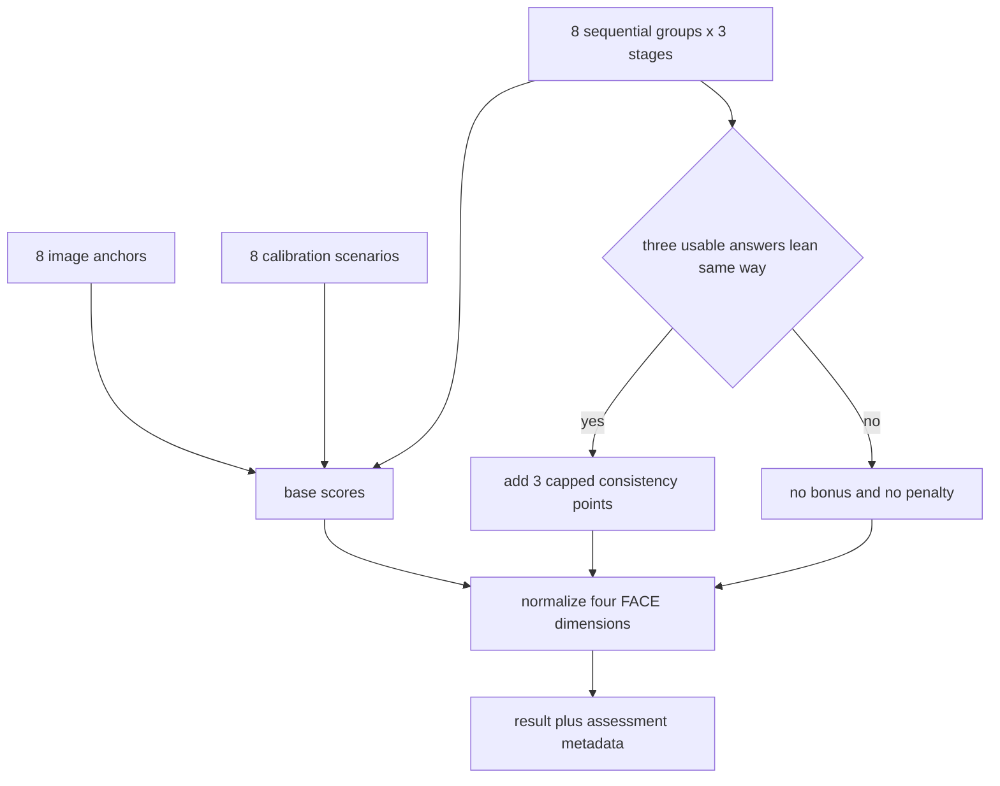

# FACE 2.0 Sequential Scenario Questionnaire - Plan

## Goal Capsule

- 將現行 40 題從重複端點辨識，升級為可觀察交易者在事件發生、壓力累積與時間拉長後是否維持同一反應模式的問卷。
- 保留 FACE 的四維度與八種行為模式，不把測驗擴張成心理診斷。
- 題庫維持 40 題與約五分鐘作答時間。
- 本輪只改問卷、計分、完整度資訊與必要介面，不改 16 型人格定義。
- 在題庫文案與計分規則核准前，不部署正式站。

---

## Product Contract

### Problem Frame

現行題庫在每個維度使用直覺題、圖像題與同意題反覆確認同一偏好。這能提高表面一致性，但容易把同義回答誤認為心理深度，也容易受社會期許與使用者猜題影響。

FACE 2.0 需要測量交易反應如何隨時間與壓力改變。核心不是詢問使用者「你積極還是保守」，而是觀察同一事件從第一次衝擊、第二次衝擊到持續發展時，使用者會維持、加強、反轉或失去原本做法。

### Requirements

**題庫結構**

- R1. 問卷固定為 40 題，並維持四個維度各 10 題。
- R2. 新題庫由 8 題圖像基準、8 題獨立校準與 8 組三階段連續情境組成。
- R3. 四個維度各有 2 題圖像基準、2 題獨立校準與 2 組三階段連續情境。
- R4. 保留目前使用者已核准的原始 8 題圖像題，重新編為第 1–8 題。
- R5. 刪除現行第 1–8 題直覺題與第 17–24 題同意題，不用換句話方式保留相同構念。
- R6. 現行第 25–40 題只保留有辨識力的情境核心，分別改寫為獨立校準題或連續情境種子。

**連續情境**

- R7. 每組連續情境包含事件初現、壓力累積與時間放大三個階段。
- R8. 同一組三題必須只測一個 FACE 維度，其他條件保持對稱，避免同時測量風險承受、週期與集中度。
- R9. 每一階段提供五段式雙極答案與「這個情境不適用於我」。
- R10. 介面要讓使用者理解事件正在延續，但不顯示人格代碼、計分方向或一致性加分規則。
- R11. 連續題不能用同義句重複；每一階段必須增加新的時間、資訊或壓力條件。
- R12. 問卷文案使用可能性語言，不把交易行為推論成創傷、恐懼或人格缺陷。

**計分與完整度**

- R13. 所有單題先依既有五段量尺計入基本分數，再於完成整組後判斷一致性。
- R14. 三題皆為非中立、非不適用，且方向完全一致時，該方向額外加 3 點。
- R15. 任一題反向、中立或不適用時，該組不加成；系統不懲罰反轉，也不把它判定為不誠實。
- R16. 每個維度最多取得兩組共 6 點一致性加成，避免連續題壓過其他證據。
- R17. 結果 metadata 記錄每組方向、是否一致、加成點數與不適用比例，供結果說明及日後校準。
- R18. 連續情境不適用比例超過五成時，延用結果頁的資料不足警示。

### Questionnaire Architecture

| 區段 | 題數 | 每維度 | 用途 |
|---|---:|---:|---|
| 圖像基準 | 8 | 2 | 快速辨識自然偏好，保留原始八張圖 |
| 獨立校準 | 8 | 2 | 用不同交易事件檢查端點，不產生連續加成 |
| 連續情境 | 24 | 6 | 每維度兩組、每組三階段，測量壓力下的穩定與變形 |
| 合計 | 40 | 10 | 四維度平衡 |

### Sequential Scenario Matrix

| 組別 | 維度 | 事件 | 階段一 | 階段二 | 階段三 | 觀察重點 |
|---|---|---|---|---|---|---|
| F1 | A／P | 才剛買就遇到突然風險 | 首次逆向但未失效 | 第二個不利事件出現 | 風險持續且接近預設上限 | 保留上行曝險或優先降低回撤 |
| F2 | A／P | 沒研究清楚卻突然大漲 | 意外浮盈 | 漲幅擴大 | 高點回吐一部分 | 放大機會或保護既有成果 |
| A1 | R／I | 憑感覺買進後大漲 | 原始理由不足 | 盤面持續轉強 | 基本資訊與盤面開始矛盾 | 補齊可驗證理由或依情境訊號判讀 |
| A2 | R／I | 突發風險與訊息衝突 | 單一負面訊息 | 多來源互相矛盾 | 價格、類股與資料不同步 | 依條件鏈或整體市場感更新決策 |
| C1 | L／T | 買進後短期下跌 | 當日逆向 | 兩週沒有修復 | 兩個月仍盤整但假設未失效 | 給假設時間或提高資金週轉效率 |
| C2 | L／T | 連續虧損 | 連續兩筆 | 連續四筆 | 拉長到完整樣本仍低迷 | 維持原系統週期或暫停並切換節奏 |
| E1 | C／D | 最大持倉遭遇風險 | 單一部位下跌 | 同類標的受波及 | 組合相關性突然升高 | 保留高信念核心或重新分散風險 |
| E2 | C／D | 組合連續虧損 | 少數部位虧損 | 多部位同步虧損 | 僅一個方向仍相對強勢 | 集中到最強證據或限制單一方向影響 |

### Independent Calibration Matrix

| 維度 | 校準題一 | 校準題二 | 可承接的現有題目核心 |
|---|---|---|---|
| A／P | 錯過第一段行情後是否降低進場標準 | 提前達成年目標後是否維持風險水位 | 現行 29、33、37 |
| R／I | 原定買點未到但盤面連續轉強 | 被問及買進理由時如何表達決策依據 | 現行 30、34、38 |
| L／T | 其他族群轉強但原持股邏輯仍在 | 可能再盤整三至六個月時如何配置 | 現行 31、35、39 |
| C／D | 五個標的中有一個信心最強 | 新資金面對三個低相關部位如何分配 | 現行 32、36、40 |

### Acceptance Examples

- AE1. 使用者在 F1 三階段都選擇偏 A，三題照常計分，完成第三題後另加 A 3 點。
- AE2. 使用者在 F1 依序偏 A、偏 A、中立，三題照常計分，但不產生一致性加成。
- AE3. 使用者在 F1 依序偏 A、偏 P、偏 P，系統保留反轉軌跡，不加分也不扣分。
- AE4. 使用者在一組內選一次不適用，其餘兩題仍計分，但整組不產生一致性加成。
- AE5. 同一維度兩組都一致偏向同一端時，最多額外加 6 點，不再疊加。
- AE6. 使用者重新整理或登入後，連續組的基本答案、加成與完整度資訊仍可還原。

### Scope Boundaries

- 不把一致性稱為心理健康、紀律或能力。
- 不因中途反轉而給負分；反轉本身是可用於未來結果解讀的行為訊號。
- 不在本輪依序列結果直接新增創傷、恐懼或底層需求結論。
- 不在本輪修改 16 型代碼、名稱或角色。
- 新生成的第 1–8 題直覺插畫在新架構中不再引用；核准實作前先保留檔案，避免不可逆刪除。

---

## Planning Contract

### Key Technical Decisions

- KTD1. 題目結構使用 8＋8＋24，而不是保留 16 題端點偏好題。這讓一半以上題數測量真實交易事件，同時保留低負擔圖像入口。
- KTD2. 一致性採整組一次性加 3 點，而不是每題倍率加權。最大影響為單一維度 6 點，足以辨識穩定反應但不會主宰人格分類。
- KTD3. 題庫新增 `scenarioGroup`、`scenarioStage` 與 `consistencyEligible` metadata。計分邏輯依 metadata 分組，不依題號或字串命名推斷。
- KTD4. 計分函式從 React 元件抽離為純函式模組。這使連續加分、反轉、不適用與版本相容性可獨立測試。
- KTD5. 問卷版本升級為新的不可變版本字串。既有 `face-baseline-40q-v2` 結果仍可讀取，不以新規則重算舊答案。
- KTD6. 連續三題在畫面上保持相鄰，但隱藏前一題答案並只顯示「情境進展 1／3」等中性標示，以降低迎合一致性的動機。

### High-Level Technical Design

### Data Shape

`FaceQuestion` 需新增可選欄位：

- `scenarioGroup`: 穩定群組 ID，例如 `focus-sudden-risk`。
- `scenarioStage`: `1 | 2 | 3`。
- `consistencyEligible`: 是否參與一致性判定。
- `scenarioContext`: 供介面顯示同一事件的中性短標題。

`FaceAssessmentMeta` 需新增：

- 每組的有效答案數。
- 每組的主要方向或 mixed。
- 每組的一致性加成。
- 所有一致性加成合計。

---

## Implementation Units

### U1. Rewrite and version the 40-question bank

- **Goal:** 建立可逐題審稿的正式 40 題，移除重複直覺與同意題。
- **Requirements:** R1–R12。
- **Files:** `data/faceQuestionsV2.ts`, `types.ts`, `docs/plans/2026-08-12-face-2-questionnaire-v2-review-draft.md`。
- **Approach:** 保留原始八題圖像題；新增八題獨立校準；依 Sequential Scenario Matrix 寫出 24 題三階段情境。
- **Test Scenarios:** 驗證總題數 40、四維度各 10、每個連續群組恰有三階段、所有二選一題都有兩張圖片。
- **Verification:** 以題庫結構測試與人工文案審查確認。

### U2. Extract and extend scoring

- **Goal:** 以純函式計算基本分數、一致性加成、正規化分數與 metadata。
- **Requirements:** R13–R18。
- **Files:** `services/faceScoring.ts`, `components/FaceAssessment.tsx`, `types.ts`。
- **Dependencies:** U1。
- **Approach:** 將現行 `calculateScores` 移出元件；依 `scenarioGroup` 判斷方向一致性；每組只加一次並套用每維度上限。
- **Test Scenarios:** 覆蓋 AE1–AE5、四維度平衡、全中立、全不適用、方向反轉及舊版本不重算。
- **Verification:** 純函式測試加 production build。

### U3. Present sequential context without response priming

- **Goal:** 讓使用者感受到同一事件持續發展，但不誘導保持前一答案。
- **Requirements:** R7、R9、R10、R11。
- **Files:** `components/FaceAssessment.tsx`。
- **Dependencies:** U1。
- **Approach:** 顯示中性事件名稱與階段進度；不顯示前一階段答案、人格代碼或加成說明。
- **Test Scenarios:** 從第一階段選到第三階段；返回頁面不洩漏計分；手機版五段答案仍可操作；不適用可正常前進。
- **Verification:** 本機瀏覽器走完至少一個完整三階段組合。

### U4. Persist and explain result confidence

- **Goal:** 保存連續題 metadata，並延用資料不足警示。
- **Requirements:** R17、R18。
- **Files:** `services/assessmentPersistence.ts`, `services/guestResultClaim.ts`, `lib/database.types.ts`, `components/Dashboard.tsx`, `supabase/migrations/*_support_face_sequential_groups.sql`。
- **Dependencies:** U2。
- **Approach:** 將新 metadata 以向後相容欄位保存；若資料庫尚未升級，瀏覽器結果仍可完成並保留本機副本。
- **Test Scenarios:** 匿名完成、登入後認領、九組以上不適用警示、舊結果載入、新結果重新整理後載入。
- **Verification:** production build、資料庫 migration review 與本機持久化走測。

### U5. Review wording and run response-pattern fixtures

- **Goal:** 確認新題沒有答案價值暗示、跨維度污染或過度心理推論。
- **Requirements:** R8、R11、R12、R15、R16。
- **Files:** `docs/plans/2026-08-12-face-2-questionnaire-v2-review-draft.md`, `tests/faceScoring.test.ts` 或專案採用的等價測試路徑。
- **Dependencies:** U1–U4。
- **Approach:** 建立八種純端點、四種反轉、全中立、部分不適用與隨機混合 fixture，核對人格碼與加成範圍。
- **Test Scenarios:** 每種端點模式得到預期四碼；反轉不加成；加成不超過每維度 6 點；不適用不被算成中立。
- **Verification:** 自動測試、`npm run typecheck`、`npm run build` 與完整 40 題人工走測。

---

## Verification Contract

| Gate | Command or method | Done signal |
|---|---|---|
| 題庫結構 | 題庫結構測試 | 40 題、四維度各 10、8 個三題群組 |
| 計分 | 純函式 fixture tests | AE1–AE6 全數通過 |
| 型別 | `npm run typecheck` | 專案程式無 TypeScript 錯誤 |
| 建置 | `npm run build` | Vite production build 成功 |
| 互動 | 本機 `/test` 瀏覽器走測 | 圖像、校準、三階段與不適用均可完成 |
| 結果 | 本機結果頁檢查 | 分數、加成 metadata 與資料不足警示一致 |
| 文案 | 逐題人工審稿 | 無同義重複、無明顯好壞答案、無心理診斷語句 |

---

## Definition of Done

- 新版 40 題逐題文案、選項方向與群組關係經使用者核准。
- 現行重複的第 1–8 題與第 17–24 題不再被正式題庫引用。
- 四維度各 10 題，且每個維度包含兩個獨立三階段事件。
- 一致性加成只在三題同向且皆為有效非中立答案時發生。
- 單一維度加成上限為 6 點，反轉與不適用不扣分。
- 新舊問卷結果可共存，舊結果不套用新版規則重算。
- 資料不足警示、匿名保存與登入認領維持正常。
- 自動測試、型別檢查、production build 與 40 題人工走測完成。
- 未採用的實驗題目、圖片引用與死碼已從正式執行路徑移除。
