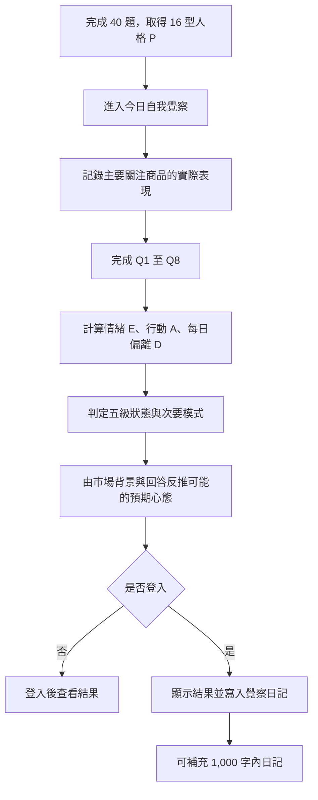

# FACE Daily v1｜正式功能規格

文件版本：2026-08-13
模型版本：`face-daily-v1.2`
狀態：Phase 1 可測 Prototype

## 1. 產品定位

FACE Test 回答「我平常傾向怎麼交易」；FACE Daily 回答「今天的市場與情緒，怎麼拉動了我」。

FACE Daily 不要求使用者預測盤勢。系統以今天主要關注商品的實際表現、感受字詞、情緒強度、看盤頻率與實際行動，反推一段「今天可能帶著什麼預期心態」的覺察文字。

結果不是診斷、投資建議或市場預測，也不以盈虧判斷回答好壞。

## 2. Phase 1 範圍

1. 已有 FACE 16 型結果的使用者進入每日覺察。
2. 完成 8 題；第 1 題記錄主要關注商品的實際表現。
3. Q2 感受字詞與 Q5 注意力拉力可複選，最多各 3 項。
4. Q3 為 5 級盤勢拉動程度題；Q6 記錄相對於原計畫的看盤頻率；Q7 檢查價格變化是否改變決定。
5. 系統計算情緒波動、行動偏離、今日狀態與次要模式。
6. 結果頁最後顯示「可能的預期心態」，明確標示為反推線索。
7. 登入後一天保存一筆；同一天再次完成會覆蓋原紀錄。
8. 結果寫入覺察日記，日記文字另存且上限 1,000 字。

Phase 1 不依賴市場 API，由使用者選擇主要關注商品的當日表現。Phase 2 才自動帶入市場資料並允許修正。

## 3. 使用者流程



## 4. 輸入題目

### Q1｜商品表現

題目：今天你主要關注的商品，表現比較接近哪一種？
輔助：以今天最常關注或主要持有的商品為準；只記錄實際走勢，不需要猜明天。

- 明顯上漲 `strong_up`
- 小幅上漲 `up`
- 平盤震盪 `flat`
- 小幅下跌 `down`
- 明顯下跌 `strong_down`
- 今天沒有留意這項商品 `unknown`

### Q2｜今日感受（複選，最多 3 項）

題目：哪些字最接近你今天面對市場的感覺？

- 平靜、好奇、沒底、緊繃、懊悔、不甘心、興奮、有把握、怕錯過、想追回、想證明、想暫停
- 沒有明顯感覺：互斥選項

### Q3｜波動程度（單選）

題目：今天的盤勢波動，會讓你……？

1. 幾乎沒有影響
2. 忍不住多看幾眼
3. 注意力常被拉回行情
4. 開始改變原本判斷
5. 很想立刻做點什麼

### Q4｜決定理由（單選）

題目：你有辦法清楚表達今天操作或不操作的理由嗎？

1. 可以清楚寫出原本設定的條件
2. 大方向說得出來，但中間有一些臨時調整
3. 當時就是覺得應該做點什麼
4. 事後回頭看，也不太確定當時為什麼這樣決定

### Q5｜注意力拉力（複選，最多 3 項）

題目：今天最影響你注意力的，可能是以下哪些事？

- 擔心風險繼續往不利方向擴大
- 原本的判斷可能需要被重新檢查
- 一個本來可以參與的機會跑掉
- 已經發生的損失或獲利回吐
- 不確定接下來會發生什麼
- 今天沒有特別放不下的事
- 今天走勢讓我覺得機會正在變好
- 最近判斷滿順，想把握更多機會

### Q6｜看盤頻率（單選）

題目：和你的交易週期及原定計畫相比，今天查看行情的頻率比較接近？
輔助：判斷的是今天有沒有比自己原本需要的更常回去看，不比較你和別人的次數。

- 今天沒有查看
- 只在原定時間查看
- 比原定多看了 1～3 次
- 明顯比原定更頻繁
- 幾乎一直盯著，很難停下來

### Q7｜行情影響（單選）

題目：如果今天的價格沒有這樣變化，你還會做出相同的決定嗎？

- 會，原本的交易條件沒有改變
- 大致會，但時間或部位可能不同
- 不確定，我是邊看行情邊決定
- 可能不會，今天的走勢明顯影響了我
- 不會，我主要是看到價格變化後才行動

### Q8｜實際行動（複選）

題目：今天實際發生了哪些事？

- 所有決定都照原計畫（互斥）
- 今天沒有交易
- 比原定時間更早進場
- 原本不打算買，後來買了
- 追價
- 部位加到超過原本計畫
- 減少部位
- 提前出場或停損
- 延後原本的停損或出場
- 取消原本打算做的交易
- 停損後短時間再次進場
- 短時間內做了比平常更多決定
- 主動停止後續交易
- 其他

追問：這些行動和你今天原本的交易計畫有多接近？

- 完全在計畫內 `0`
- 條件符合，但時間或部位有小幅調整 `1`
- 大方向相同，但不是原本設定好的做法 `2`
- 多數是盤中臨時決定 `3`
- 和原本計畫相反，或取消了原本紀律 `4`
- 今天開始前沒有設定明確計畫 `none`

## 5. 計分模型

### 5.1 情緒波動 E

將 Q2 感受字詞依強度轉為 0～100；同題複選時取平均。Q6 看盤頻率只占低權重，避免把策略必要監控直接判為焦慮。

```text
F = Q2 感受字詞平均強度
I = (Q3 - 1) / 4 × 100
C = Q4 理由清楚度反向分數
R = Q6 主動看盤頻率

E = 0.35F + 0.30I + 0.15C + 0.20R
```

### 5.2 行動偏離 A

```text
H = Q8 所選行動中的最高強度 / 4 × 100
L = Q8 計畫偏離程度 / 4 × 100
P = Q7 行情影響程度 / 4 × 100

baseA = 有計畫基準時 0.70L + 0.30(H × L / 100)；沒有基準時為 H
A = 0.75baseA + 0.25P
```

主動減碼、停損或停止交易不因動作本身被判為失控；是否偏離以原計畫為基準。

### 5.3 每日偏離 D

```text
D = 0.40E + 0.50A + 0.10(E × A / 100)
```

### 5.4 五級主要狀態

| D 分數 | 狀態 |
|---:|---|
| 0～20 | 穩定 `stable` |
| 21～40 | 有波動 `fluctuating` |
| 41～60 | 拉扯 `conflicted` |
| 61～80 | 偏離 `deviated` |
| 81～100 | 需要暫停 `pause_needed` |

保護規則：有計畫基準且 A ≥ 60，主要狀態不得低於「偏離」；A ≥ 80 且 E ≥ 60 或 D ≥ 80，主要狀態為「需要暫停」。

## 6. 次要今日模式

次要模式用來描述今天的心理運作，不取代五級主要狀態。

- 節奏清楚 `steady`
- 等待條件 `watching`
- 急著追回 `chasing`
- 還沒放下 `attached`
- 先保護自己 `guarded`
- 暫停重整 `resetting`
- 多重拉扯 `mixed`

模式由 Q2、Q5、Q8 的證據點決定；同一題的同一模式只應有限度加分，並保留平手為 `mixed`，避免硬分類。

## 7. 可能的預期心態

### 7.1 原則

- 不直接問「你預期上漲還是下跌」。
- 由 Q1 商品表現、Q2 感受字詞、Q3 情緒強度、Q6 看盤頻率、Q7 行情影響與今日模式反推。
- 必須使用「可能、看起來、值得留意」等覺察語氣。
- 不寫成確定事實，不宣稱讀懂潛意識，不提供市場方向建議。
- 大盤為 `unknown` 時明確降低信心。

### 7.2 範例

| 市場背景與模式 | 反推文案方向 |
|---|---|
| 上漲＋急著追回 | 可能期待上漲仍有參與空間，後來注意力轉向不能落後 |
| 上漲＋先保護自己 | 可能沒有完全預期漲勢速度，追高與錯過感同時放大 |
| 下跌＋先保護自己 | 可能期待風險仍可控，下跌後保護需要變強 |
| 下跌＋急著追回 | 可能期待行情修復，下跌後出現改寫結果的拉力 |
| 盤整＋等待條件 | 可能原本就接受等待，焦點仍在條件完整度 |
| 未記錄大盤 | 缺少市場背景，只呈現來自回答的較低信心線索 |

## 8. 結果頁結構

1. FACE 動物與人格名稱。
2. 今日五級主要狀態。
3. 次要今日模式。
4. 今天主要商品表現。
5. 情緒波動 E、看盤頻率與行動偏離 A。
6. 今日摘要。
7. 一句覺察洞見。
8. 一個反思問題。
9. 最後顯示「系統反推｜可能的預期心態」。
10. 提醒：這是依今日市場與回答整理的線索，不是對內心的確定判讀。

結果頁不得以盈虧、勇敢／膽小、積極／保守評價使用者。

## 9. 日記與保存

- 已登入使用者以 `user_id + local_date` 為唯一日期紀錄。
- 同一天重新完成：更新原紀錄，不新增第二筆。
- 覺察答案、衍生結果與自由文字分開保存。
- 自由文字上限 1,000 字。
- 日記週／月曆以主要狀態 icon 顯示，點擊日期可查看當日完整結果。
- 歷史資料若只有舊六狀態，仍可使用相容 renderer 顯示。

Phase 1 沿用既有 `daily_awareness_entries.answers` JSONB，將完整衍生結果存於 `_result`，避免在 Prototype 階段先做破壞性資料庫 migration。

```json
{
  "market": ["down"],
  "q2": ["tense", "recoup"],
  "q3": ["4"],
  "q4": ["B"],
  "q5": ["loss_attachment", "uncertainty"],
  "q6": ["much_more"],
  "q7": ["probably_not"],
  "q8": ["reduced"],
  "q8_plan": ["1"],
  "_result": {
    "modelVersion": "face-daily-v1.2",
    "statusCode": "conflicted",
    "patternCode": "attached",
    "emotionScore": 67,
    "actionScore": 24,
    "dailyDeviation": 43,
    "inferredMindset": "..."
  }
}
```

## 10. 結果信心

| 條件 | 信心 |
|---|---|
| 已記錄大盤，且有明確交易計畫基準 | `medium` |
| 未留意大盤，或當天沒有明確計畫基準 | `low` |

Phase 1 不顯示 `high`，因為市場背景仍由使用者自行選擇；Phase 2 導入可核對行情後再評估提高信心。

## 11. Phase 1 驗收條件

1. 頁面不出現要求使用者預測盤勢的題目。
2. Q1 明確詢問主要關注商品的實際表現。
3. Q2、Q5 可以複選，最多 3 項，互斥選項行為正確。
4. Q3 顯示 1～5 級程度；Q6 顯示相對看盤頻率；Q7 顯示行情影響，且均只能單選。
5. 未完成目前步驟不能前進或送出。
6. 結果頁可顯示五級狀態、模式、E、A、摘要與反思題。
7. 可能的預期心態出現在結果最後，且附反推線索聲明。
8. 未登入送出時先要求登入；登入後完成保存並顯示結果。
9. 同一天再次完成會覆蓋原紀錄。
10. 日記頁能讀取新結果，也能相容舊資料。
11. TypeScript 型別檢查與正式建置通過。

## 12. 延後項目

- 市場 API 與自動大盤資料。
- 依個別持倉或交易標的建立市場背景。
- 以樣本資料校正權重與狀態門檻。
- 16 型專屬提醒文案的完整內容庫。
- FACE Mirror 與實際交易紀錄交叉分析。
- 付費工具與交易生存指南解鎖。
